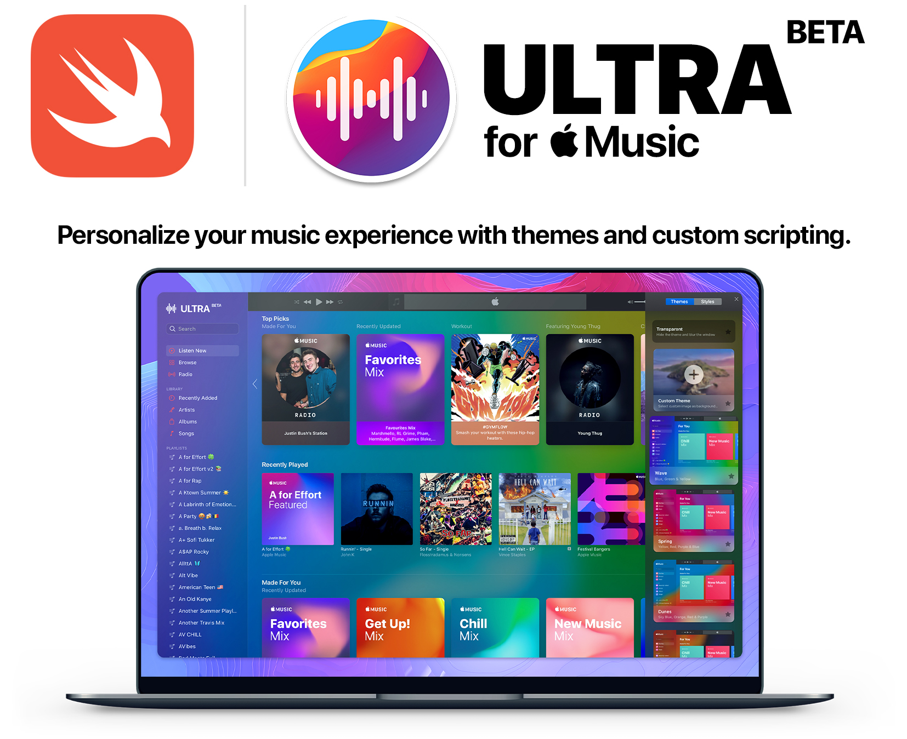

## Legacy Branch
Compatible with macOS 10.12+



# Themes for Apple Music
A custom Apple Music client with themes, personalized settings and more.

## [Download Latest Stable Build](https://github.com/revblaze/AppleMusicUltra/releases/download/v0.8-alpha/Themes-b4.zip) <sup>(macOS 10.14 and higher)</sup>
`Themes-b4.zip (9MB) Preview 4, alpha 8` (April 9, 2020)

Drag & drop to `/Applications` if you want to keep it after trying. 🤗

Updating from an older version? Drag and drop to `/Applications` and click `Replace`.

### Support for macOS 10.13 and lower
[Download the Latest Stable Legacy Build](https://github.com/revblaze/AppleMusicUltra/releases/download/v0.8-alpha/Themes-b4-legacy.zip) `Themes-b4-legacy.zip (13.8MB) Preview 4, alpha 8L1` (April 12, 2020)

<i>This app is currently under heavy development.</i>

# Customization
Allow users to personalize their Apple Music with customization.

**Note:** I recently merged the private beta code with the master branch. The new code (April 9, 2020) includes major structural changes, additional features, bug fixes and a UI overhaul. Due to this, the below documentation is not up-to-date and will need to be rewritten. It's currently exam season here, so I may not have time to do this for a little while. Thank you for your patience!

## Themes


Ultra for Apple Music is a personalized Music client with custom themes, settings and more using JavaScript injection through the beautiful object that is WKWebView.

**Basic Syntax:** `setTheme(Style, darkMode: Bool, media: Any, type: String)`

## Styles

Styles are the top-layer effects that appear over every theme type. Using `setTheme`, they can be set to overlap your object-based theme to add some vibrant effects; or alternatively, they can be set to blur your system background using the built-in function `setTransparentTheme()`.

**Tansparent:** `setTheme(NSVisualEffectView.Material, darkMode: Bool, media: nil, type: "transparent")`

**with Object:** `setTheme(NSVisualEffectView.Material, darkMode: Bool, media: Object, type: String)`

## Custom Themes

Setting a custom, user-selected image is as simple as prompting the user for the `URL` path of their `file://` and setting it as the `media` property.

```
let imageURL = selectImageFile()
setTheme(NSVisualEffectView.Material, darkMode: Bool, media: imageURL, type: "image")
```
```
func selectImageFile() -> URL {
    let dialog = NSOpenPanel()
    dialog.allowsMultipleSelection = false
    dialog.allowedFileTypes = ["png", "jpg", "jpeg"]
    
    if (dialog.runModal() == NSApplication.ModalResponse.OK) {
        if let result = dialog.url?.absoluteURL { return result }
    }
}
```

## UI Appearance
Each theme has a `darkMode: Bool` property that sets the Music Web Player<sup>BETA</sup> Light/Dark mode.
```
darkMode = true    // Force Dark Mode
darkMode = false   // Force Light Mode
```

Just wanted to give a shout out to the devs behind the Web Player for designing this beautiful web app. The design of the UI seems to conform to its containers' `AppleInterfaceStyle`. Meaning everything in the web app has a Light mode and Dark mode property and conforms to whatever the theme mode is set to.

Thus, this property's main function is to toggle the Light/Dark mode of the Music Web Player<sup>BETA</sup>

## Structure <sup>for now...</sup>
`let fx = NSVisualEffectView.Material`
```
struct Style {                                 //                          rawValue
    static let preset   = fx.appearanceBased   // Default Preset               0
    // Light Mode Styles                       LIGHT
    static let frosty   = fx.sheet             // Frosty       (Opaque)        11
    static let bright   = fx.mediumLight       // Bright       (Middle)        8
    static let energy   = fx.light             // Vibrant      (Transparent)   1
    // Dark Mode Styles                        DARK
    static let cloudy   = fx.ultraDark         // Cloudy       (Opaque)        9
    static let dark     = fx.toolTip           // Dark         (Middle)        17
    static let vibrant  = fx.dark              // Vibrant      (Transparent)   2
}
```

## WKWebView
Assignment due at midnight, brb.


## Requirements
Requires macOS 10.14 or later.

<sub><i>Please note that the app is being built with Swift 5.</i></sub>
