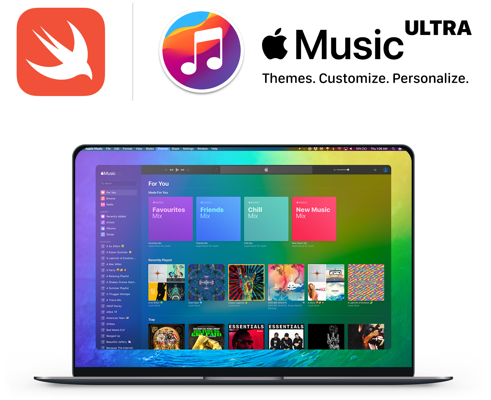

# Ultra for Apple Music
 A custom Apple Music client with themes, personalized settings and more.

Ultra for Apple Music is a personalized Music client with custom themes, settings and more using CSS->JavaScript injection through the beautiful object that is WKWebView.

## [Download Latest Stable Build](https://github.com/revblaze/AppleMusicUltra/releases/download/v0.3-alpha/Ultra_v0.3-alpha.zip)
`Ultra-v0.3.zip (5.5MB) build 3`

Left-click `Ultra for Apple Music.app > Open` to bypass the App Store wall & drag-drop to `/Applications` if you want to keep it after trying. 🤗

Updating from an older version? Drag and drop to `/Applications` and click `Replace`.

<i>This app is currently under heavy development</i>

## Requirements
Requires macOS 10.14 or later.

<i>Please note that the app is being built with Swift 5.</i>
