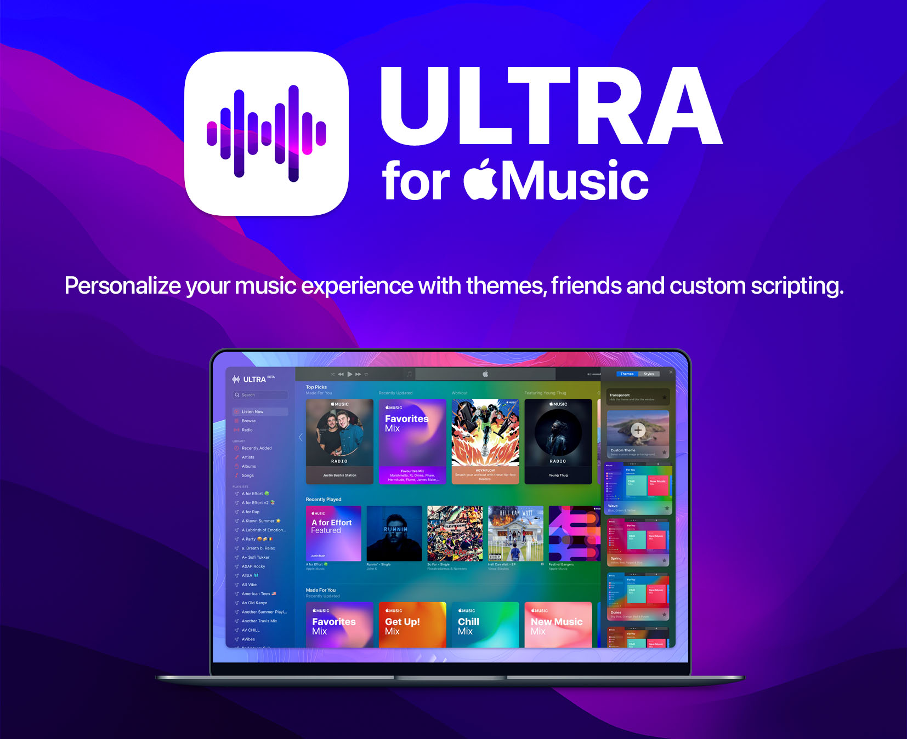
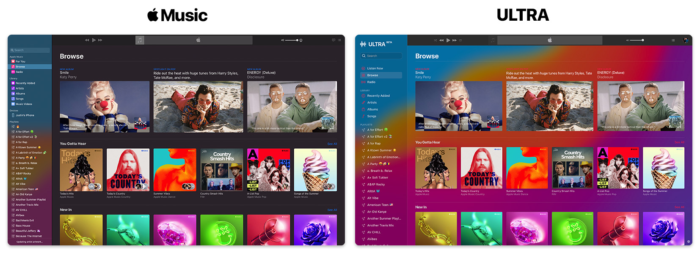
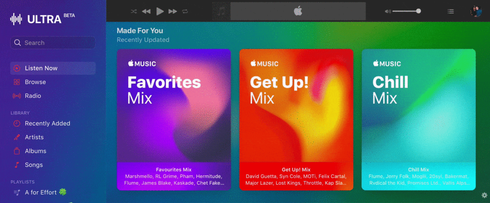
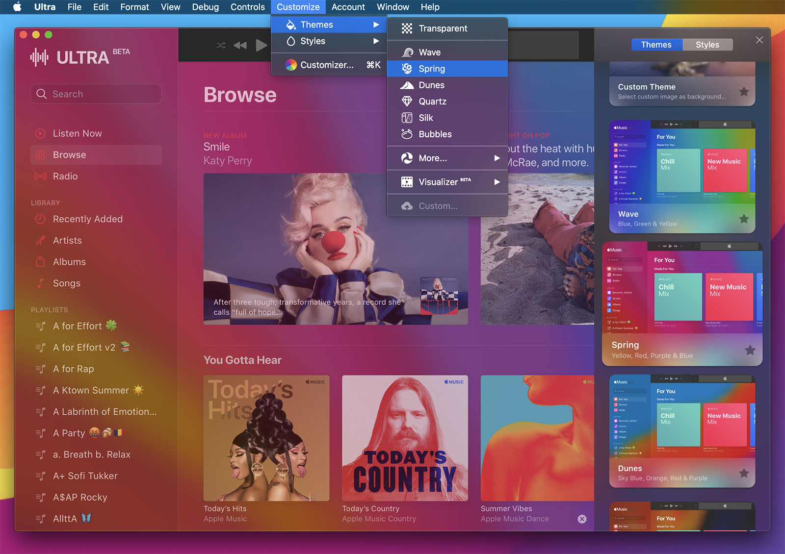

<sup>This project uses the [TypeSwift](https://github.com/TypeSwift) framework, a bridging-interface for TypeScript and Swift.</sup>

# Ultra for Music
The ultimate Music client with a customizable personality. Upgrade your music experience with themes, styles, custom scripting, personalized settings, friends, followers and more. Built on [macOS Monterey](https://www.apple.com/macos/monterey-preview/) with backwards compatibility in-mind.

## Coming Soon <sup>v2</sup>
Brace yourselves, a major update is coming to Ultra! I've completely redesigned the codebase, added further functionality and freedom with custom scripting, as well as UI customization. Furthermore, I'm in the process of implementing a Spotify-like social feed that'll allow you to keep up with what your [Music friends](https://github.com/revblaze/AppleMusicFriends) are listening to. 

The current project, along with this README, need a complete rework. Since many of you have been waiting patiently – over the past year and a little bit – for the next release, I will be priortizing the publication of the standalone Ultra v2 app. The programmatic documentation will follow soon after.

In the meantime, feel free to checkout [Music Friends](https://github.com/revblaze/AppleMusicFriends). Any contribution is welcome and greatly appreciated!

## [Download Latest Stable Build](https://github.com/revblaze/AppleMusicUltra/releases/download/v1.0-beta.1/Themes-v1.0b1.zip) <sup>(macOS 10.12 and higher)</sup>
`Themes-v1.0b1.zip (25MB) Public Beta 1` (April 17, 2020)

Drag & drop to `/Applications` if you want to keep it after trying. 🤗

<sup>Updating from an older version? Drag and drop to `/Applications` and click `Replace`.</sup>

# Customization
Personalize your music experience with the **Customizer**. User-selectable images, videos, web content and more.


Ultra for Music is a highly-customizable client. This project started as more of a POC for two-way communicable scripting through WebKit using both JavaScript and native Swift. Since then, it has become a fun little side-project.



Personalizing the experience was a major inspiration for Ultra. When I first approach a project (with a UI), the presentation and appearance is a major priority for me. Especially with an app such as Music – that is heavily used with a high retention rate – the lack of customization was enough for me to start anew.

# Music 2 <sup><sup>BETA</sup></sup>

Start using the new Music without having to install the macOS 11 Big Sur beta.



Ultra is set to the AMWP beta by default. You can change this in `Configuration > MusicPlayer > Music.swift`

```
static let url = Service.appleBeta.url     // Latest Beta Release
static let url = Service.apple.url         // Latest Public Release
```

See `.url` in the `Service` enum at the bottom of **Music.swift** for more details.


# The Customizer

The **Customizer** allows you to browse and apply themes using images, video and/or web animation. It also allows you to apply styles – which essentially manages the transparency, vibrancy and blurring effects for both `.light` and `.dark` modes (using `NSAppearance`).



**Note:** Since its last major update in June 2020, I have decided to transition Ultra away from `Theme` presentation through individual, native objects such as `NSImageView` and `AVPlayerView`. Instead, I have decided to transition towards one, universal object that is capable of presenting all `ThemeTypes`: `WKWebView`.

If I find that the `WKWebView` requires a considerable amount of power – or anything that impacts performance/energy – I will provide these native objects as an alternative method of presentation in the future. I have yet to compare the impacts of either. Please feel free to do so yourself and present your results as an [issue](https://github.com/revblaze/Ultra/issues).


## Customizer: Themes

Liven up your music experience with the <strong>Ultra Visualizer <sup>BETA</sup></strong>. Test these new dynamic themes by going to the main menu and selecting `Customize → Themes → Visualizer`.


<sub>The Dynamic Gradient `Theme` created with HTML5/CSS3 animations and presented through `fxWebView` using `ThemeType.webContent`.</sub>

### `Theme`
 - **name:** `String` literal of the theme name
 - **type:** `ThemeType` object to display in the `fxWebView`
 - **raw:** `String` literal of the content source (dependent on `ThemeType`)
 - **style:** `Style` object that sets the window appearance
 - **isTransparent:** `Bool` that handles `fxWebView.isHidden` and `blurView.blendingMode`
 
Note that `Style` is just another attribute of `Theme`. This is so that `Theme` can be easily packaged for saving, as well as being extracted as a single object.

### `ThemeType`
  - `.image`: A still image that is preferably colourful and low resolution/quality
  - `.video`: A WebKit-friendly video that is streamable from a raw URL (`/video.mov`)
  - `.webContent`: Custom web pages that are used to present HTML5/CSS3 animations
  - `.custom`: User-selected media file (local or URL) to be displayed using `.image` or `.video`

## Dynamic Themes: Visualizer <sup>BETA</sup>
Since both `.video` and `.webContent` types have the same resulting effect to the end-user, they are being grouped as **Dynamic Themes**. You may see me using the terms interchangeably. Furthermore, due to the iTunes visualizer being discontinued, I thought it only appropriate to *market* dynamic themes under the term: **Visualizer**. You may also see me using this word interchangeably.

`TL;DR: visualizer == dynamic == (.video || .webContent)`

These dynamic themes use a combination of HTML5/CSS3 animations, as well as highly compressed video (preferably H.265 in an HEVC container). The resulting animations are presented beneath the standard blurring and vibrancy effects of `blurView: NSVisualEffectsView`. Thus, due to the finite detail required from these resources, it is recommended that you follow these standards: 

### `.video`
 - Low quality, low resolution and high compression
 - Bright, vibrant colours
 - Short in length (`< 20s`)
 - Loop-ready if possible

Since everything in `fxWebView` has a blurry, somewhat-dence overlay effect (`NSVisualEffectsView`) – efficiency, performance and limiting resource demand is key. You do not need a fully-detailed, 1080p video with mediocre compression to act as a dynamic effect. Your videos should only provide what is necessary to get the desired effect.

#### `.video` Example

Take my dynamic video theme, Kaleidoscope, as an example. You can find the raw video file that is streamed to Ultra [here](https://visualizer.muza.io/videos/kscope.mov).

`kscope.mov` is a `1.7MB` video file that is about `4s` long, with dimensions `640x360`. Furthermore, I edited the video to loop perfectly (although, due to the density of `blurView`, perfection is not required).

#### Understanding `.video` Presentation

Head on over to `Themes > ThemeHTML.swift`. As you can see with `videoHTML(_ :)`, the HTML needed to play a video in `fxWebView` is **1 line of code**.

```
static func videoHTML(_ urlString: String) -> String {
  let html = "<body style=\"margin: 0px; background-color: black;\"><video autoplay playsinline loop height=\"100%\"  src=\"\(urlString)\"> </video>"
  return html
}
```

You don't need to have WebDev experience to understand what this line of code does. It simply takes the most minimal approach of playing a fullscreen video, within a `WKWebView`, using the WebKit standards. The `autoplay` and `playsinline` attributes allow for the video to start playing automatically and at the custom `height` set (`100% = max`). The `NSWindowController` will ensure that the following rule is met in most scenerios: `window.height <= window.length` (the window will never be taller than it is wider). Thus, it only makes sense to set the maximum height and leave width to `auto`.

The `loop` attribute allows the video to seamlessly autoplay in exactly that: a loop. If you want the dynamic theme to feel fluent and continuous - and not like a seconds-long clip on repeat - the video needs to have somewhat of a looping feel. If you have a short, small video file that you'd like to use as a dynamic theme, there are ways of creating a looping-effect without any real AV work. Online services like [ezgif.com](https://ezgif.com) will essentially take your video, double its length, and put the second half of said video in reverse. This will create an effect similar to the GIF you see in the [Music 2 section](#music-2-beta) above.

Funnily enough, the Kaleidoscope video was originally an HTML5/CSS3 animation that demanded too many resources when run in the background `fxWebView`. So instead, I opened up QuickTime Player, started a screen recording and used the built-in Trim function to end the video somewhere close to how it looked at the start.

Voila! You've created a looping animation in about 2 minutes.

### `.webContent`
 - Low resource demand
 - Vibrant and colourful
 
The `.webContent` type is exactly that: web content. I found that simple CSS3 animations demanded **far** less resources than a `.video` type would. However, upon exploring more complex animations, it slowed the client down considerably. With these complex animations running in `fxWebView`, my Mac would start to heat up and the lag of simply scrolling through AMWP was unbearable. After all, the top-layer `webView` is essentially presenting a transparent render of AMWP. Adding in another graphically-demanding visual will bring the client to a hault. 

The Kaleidoscope theme vs. Gradient theme is a perfect example of choosing efficiency. When the Kaleidoscope CSS3 animation caused the client to lag, I simply recorded it as a local file in Safari. With some minor modifications, the animation was running smoothly as a `.video`. It's all about finding the right balance.

I do plan on testing for the most efficient method of presentation – taking performance, battery life and efficiency into account.

#### `.webContent` Example

The Dynamic Gradient theme is a lot more straight-forward. This file is so small that I was able to include it, locally, within the project. It took three lines of CSS to accomplish (Technically one line, but who's counting? The compiler? Oh):

```
.css-gradient { background: linear-gradient(270deg, #ee7752, #e73c7e, #6314e6, #0960f2, #23d5ab); background-size: 1000% 1000%; -webkit-animation: Gradient 40s ease infinite; animation: Gradient 40s ease infinite; }
@-webkit-keyframes Gradient { 0%{background-position:0% 50%} 50%{background-position:100% 50%} 100%{background-position:0% 50%} }
@keyframes Gradient { 0%{background-position:0% 50%} 50%{background-position:100% 50%} 100%{background-position:0% 50%} }
```

More Visualizer effects are on the way!

## Customizer: Styles


There are currently 7 styles to choose from, each with its own `NSVisualEffectsView.material` value.

### `Style`
```
           Material              Appearance       Intensity
preset:    .appearanceBased      .system            70%
frosty:    .sheet                .light             80%
bright:    .mediumLight          .light             50%
energy:    .light                .light             30%
cloudy:    .ultraDark            .dark              80%
shadow:    .toolTip              .dark              50%
vibing:    .dark                 .dark              30%
```

Styles are the top-layer effects that overlay the `fxWebView`, as well as determine `.light` or `.dark` appearance modes. Using `Theme.style`, they can be set to overlap your object-based theme to add some vibrant effects; or alternatively, they can be set to blur your system background using `Theme.isTransparent = true`.

## Custom Themes <sup>Temporarily Disabled</sup>

Setting a custom, user-selected image is as simple as prompting the user for the `URL` path of their `file://` and setting it as the `media` property.

```
let imageURL = selectImageFile()
setTheme(NSVisualEffectView.Material, darkMode: Bool, media: imageURL, type: "image")
```
```
func selectImageFile() -> URL {
    let dialog = NSOpenPanel()
    dialog.allowsMultipleSelection = false
    dialog.allowedFileTypes = ["png", "jpg", "jpeg"]
    
    if (dialog.runModal() == NSApplication.ModalResponse.OK) {
        if let result = dialog.url?.absoluteURL { return result }
    }
}
```

## Appearance
Appearance modes are now an attribute of `Style`. 
```
Style.get().isDark      // Returns the active Style appearance mode
Theme.style.isDark      // Returns the active Theme appearance mode
```

Just wanted to give a shout out to the devs behind the Web Player for designing this beautiful web app. The design of the UI seems to conform to its containers' `AppleInterfaceStyle`. Meaning everything in the web app has a Light mode and Dark mode property and conforms to whatever the `Style` object is set to.

Thus, this property's main function is to toggle the Light/Dark mode of AMWP, as well as the entire application as a whole.

### ViewController Overview <sup>back to front</sup>

- **FXWebView:** `WKWebView` that displays all `Theme` content using local HTML (specific to `ThemeType`)
  - `if Theme.isTransparent { fxWebView.isHidden = true }`
- **BlurView:** `NSVisualEffectsView` that presents the window `Style`
- **WebView:** `WKWebView` presents and interacts with AMWP through JavaScript
- **CustomizerView:** `embedded NSView` that presents CustomizerViewController
  - CustomizerViewController utilizes the [WKScriptMessageHandler](https://developer.apple.com/documentation/webkit/wkscriptmessagehandler) protocol for communicating global `Theme` and `Style` updates upon selection

# WKWebView
TODO: Write this out.

## JavaScript Injection
TODO: Write this out.

# Branches

 - **alpha:** The original Ultra for Apple Music build
     - Prior to restructuring the Themes & Style code and adding the new Customizer from private repository
 - **legacy:** Ultra for Apple Music with support for macOS 10.13 and below
 - **webkit/fx:** All effects (static and dynamic) done through a single WebKit manager
 - ~~**beta:**~~ *(retired)* The nightly builds for the current master that will replace the alpha build as master
 - ~~**lite/musish:**~~ *(retired)* Ultra <sup>LITE</sup> for <a href="https://musi.sh/">Musish</a> (<a href="https://github.com/Musish/Musish">GitHub</a>)

**Note:** The master branch has recently been replaced with newer code for better integration with Big Sur. The previous code (August 2020) is still available and has been moved to the `alpha` branch. The previous code was mashed together and added-to when my free time was available. In short, it's a mess.

I am still in the process of rewriting and restructuring the new code as I learn better, more efficient ways of doing things. I will do my best to update the README and documentation as progress is made. Again, this is just a side-project. I will only be adding to it when I have free time available. If I want to implement a fun new feature that I think users will enjoy, I will prioritize that over cleaning and restructuring – as this is a side-project. Thank you for your patience!

## Requirements
Requires macOS 10.12 or later.

<sub><i>Please note that the app is being built with Swift 5.2</i></sub>

This app is currently under heavy development. Expect major structural changes.
